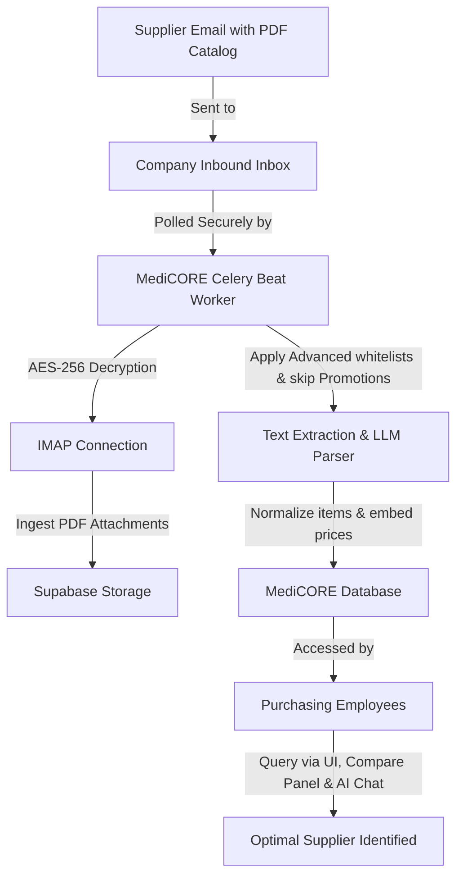

# MediCORE Client Onboarding & Setup Guide
Welcome to **MediCORE**! This guide is designed to walk your organization through the complete setup process, from initial registration and secure email access configurations to using AI-driven procurement tools to find the best suppliers.
By the end of this guide, your procurement team will be equipped to automatically ingest vendor catalogs directly from your emails and leverage advanced comparison tools to optimize purchasing decisions.
---
## Table of Contents
1. [System Architecture Overview](#1-system-architecture-overview)
2. [Step-by-Step Setup Wizard](#2-step-by-step-setup-wizard)
   - [Step 1: Account & Profile Registration](#step-1-account--profile-registration)
   - [Step 2: Connecting Email Access (Gmail App Passwords)](#step-2-connecting-email-access-gmail-app-passwords)
   - [Step 3: Account Verification & Finalization](#step-3-account-verification--finalization)
3. [User Login & Route Protection](#3-user-login--route-protection)
4. [General Polling & Custom Filters Configuration](#4-general-polling--custom-filters-configuration)
5. [End-to-End Enterprise Scenario: Apex Pharma Solutions](#5-end-to-end-enterprise-scenario-apex-pharma-solutions)
   - [The Setup at Apex Pharma](#the-setup-at-apex-pharma)
   - [The Automated Background Workflow](#the-automated-background-workflow)
   - [How Employees Find the Best Supplier](#how-employees-find-the-best-supplier)
6. [Best Practices & Security Protocols](#6-best-practices--security-protocols)
---
## 1. System Architecture Overview
MediCORE acts as your company's intelligent purchasing agent. It sits between your inbound supplier communications and your inventory database. 

- **Data Isolation**: All accounts, catalogs, and synchronization settings are isolated strictly by your company's account credentials under tenant-based isolation keys.
- **Symmetric Encryption**: All email authentication passwords stored inside the system are secured with server-side AES-256 symmetrical encryption. They are decrypted *only* in-memory for the fraction of a second needed to poll your inbox.
---
## 2. Step-by-Step Setup Wizard
Getting your organization set up is consolidated into a simple, 3-step onboarding wizard.
---
### Step 1: Account & Profile Registration
Navigate to the `/register` page to create your administrative profile:
1. **Full Name**: Enter your administrative or personal profile name (e.g. *Sarah Jenkins*).
2. **Organisation**: Enter your company's registered name. This forms the shared organization profile under which matching tenant accounts sit (e.g. *Apex Pharma Solutions*).
3. **Work Email**: Enter your business email. Note that this is your credentials email used for secure login.
4. **Password**: Choose a secure password.
   > [!NOTE]  
   > This password is used exclusively to log in to MediCORE's secure dashboard. **It is NOT your email account's password.**
---
### Step 2: Connecting Email Access (Gmail App Passwords)
After clicking continue, you will arrive at the `/register/email-setup` page to link the inbox where you receive supplier catalog emails. MediCORE connects to your email server via secure IMAP.
Currently, **Gmail** is configured as the primary provider with an active step-by-step security guide.
#### How to Generate a Secure Google App Password:
Because Google disables insecure, direct logins (Less Secure Apps), you **must** use a 16-character **App Password** instead of your primary password.
1. **Enable 2-Step Verification**:
   - Go to your [Google Account Console](https://myaccount.google.com/).
   - Click on the **Security** tab in the left-hand menu.
   - Under *How you sign in to Google*, ensure **2-Step Verification** is turned **ON**.
2. **Create an App Password**:
   - In the search box at the top of your Google Account Console, type `App Passwords` and click on it (or go directly to the Security tab, click on 2-Step Verification, and scroll to the bottom).
   - In the *App name* field, type a recognizable name like `MediCORE Ingestion`.
   - Click **Create**.
3. **Copy the Code**:
   - A modal will appear displaying a **16-character code** (e.g. `abcd efgh ijkl mnop`) inside a yellow background.
   - **Copy this password immediately.** (You will not be able to see it again).
#### Inputting Your Connection Credentials:
On your MediCORE `/register/email-setup` screen:
1. Click the **Gmail** card.
2. Enter your **Work Email** address.
3. Paste the **16-character App Password** (do not include spaces, though Google lists them with spaces).
4. Verify IMAP fields (default host is `imap.gmail.com`, default port is `993` SSL).
5. Click **Test Connection**.
   - MediCORE will instantly initiate a dry-run handshake to log in to the IMAP server.
   - If successful, a green success banner appears: `Connected successfully! App credentials passed verification.`
   - If it fails, a red warning highlights the exact IMAP error so you can double-check 2-step verification or typing errors.
   - **The "Save" button remains disabled until your connection test returns success.**
---
### Step 3: Account Verification & Finalization
Once saved, MediCORE writes your encrypted credentials to the database, schedules your first ingestion in the background immediately, and directs you to `/register/done`.
Click **Go to Dashboard** to enter your brand-new procurement workspace.
---
## 3. User Login & Route Protection
All dashboard routes (`/`, `/suppliers`, `/compare`, `/assistant`) are fully protected. 
- If an employee tries to access your dashboard without logging in, the Next.js edge middleware automatically redirects them to `/login`.
- To sign in, employees use their registered work email and MediCORE login password.
- Upon logging out, local session cookies are destroyed instantly to protect vendor catalogs.
---
## 4. General Polling & Custom Filters Configuration
Once inside the dashboard, navigate to **Settings ➔ Email Access** to configure your general polling frequency and ingestion whitelist filters.
### A. General Polling Card
- **Global Polling Interval**: Choose how frequently MediCORE connects to parse your inbox:
  - *5 minutes*, *10 minutes*, *15 minutes* (Recommended), *30 minutes*, or *60 minutes*.
- **Auto-Extract PDF Catalogue Items**: Toggling this enables our OCR and LLM (Large Language Model) parsing parser to read raw text tables inside raw attachments.
- **Push Notifications on New Catalogue Extraction**: Delivers real-time dashboard banner feeds as soon as supplier updates process successfully.
### B. Custom Ingestion Whitelists (Collapsible)
To avoid cluttering your database with irrelevant emails (receipts, chat messages), configure Whitelists:
- **Require PDF Attachment**: When checked, MediCORE ignores emails that do not contain an inventory/catalog PDF.
- **Skip Gmail Promotions & Bulk Newsletters**: Scans headers (like category signatures and unsubscribe links) to automatically skip promotional newsletters and focus strictly on direct catalog updates.
- **Sender Keyword Whitelist**: Comma-separated domains or keywords (e.g. `biotech, labs, chemical`). Only emails from senders containing these keywords are parsed.
- **Subject Keyword Whitelist**: Comma-separated terms (e.g. `catalog, inventory, pricing, sheet`). MediCORE will skip any emails whose subject line doesn't match these keywords.
---
## 5. End-to-End Enterprise Scenario: Apex Pharma Solutions
To see how these features come together, let's look at a realistic operational scenario inside a client firm.
### The Setup at Apex Pharma
**Apex Pharma Solutions** is a pharmaceutical formulation company that manufactures organic supplements. 
- **The Procurement Lead**, *Sarah Jenkins*, sets up a centralized purchasing mailbox: `purchasing-inbound@gmail.com`.
- She registers an administrative account under the organisation `Apex Pharma Solutions`.
- She connects the shared inbox using a **Google App Password** she generated inside Google settings.
- Under **Ingestion Filters**, Sarah whitelists:
  - **Sender Keywords**: `chem, pharma, biotech, supplier`
  - **Subject Keywords**: `price, catalog, stock, inventory`
  - **Skip Promotions**: `Checked`
  - **Require PDF**: `Checked`
- Under **Sync Settings**, she sets the interval to **15 minutes**.
---
### The Automated Background Workflow
1. **Supplier Broadcast**: On Monday morning, **BioTech Laboratories** sends a blast email containing their updated bulk ingredients PDF catalog (`biotech_catalog_may_2026.pdf`) to `purchasing-inbound@gmail.com`.
2. **Scheduled Poll**: 15 minutes later, the MediCORE Celery Beat worker logs into `purchasing-inbound@gmail.com` using the decrypted App Password.
3. **Filtering**: It matches the email:
   - Senders domain has `biotech` (Matches sender whitelist!).
   - Subject is `Updated Price list and Inventory Catalog May 2026` (Matches subject whitelist!).
   - Contains a PDF attachment (Matches attachment whitelist!).
4. **Ingestion & AI OCR**:
   - MediCORE uploads the PDF securely to Supabase Storage.
   - It extracts the catalog table containing ingredients, unit prices, currencies, and available stock.
   - It normalizes names (e.g. *Ascorbic Acid Powder* is mapped to the standard *ascorbic acid*).
   - Price per unit is computed, vectorized, and saved.
---
### How Employees Find the Best Supplier
Now, Apex Pharma's purchasing agent, **James**, logs into the MediCORE dashboard to buy raw materials for their next supplement batch.
#### Step 1: Accessing the Dashboard Metrics
On the **Dashboard**, James instantly sees:
- An AI alert banner: `"AI found a price drop on ascorbic acid - BioTech Laboratories is 12% cheaper than the next supplier."`
- The metrics showing **4 Active Suppliers** and **$14,200 Potential Savings** identified.
#### Step 2: In-Depth Comparison (Compare Tab)
James navigates to the **Compare** panel to double-check:
1. In the search box, he types `ascorbic acid` and clicks the auto-suggestion.
2. The **AI Score Grid** appears, scoring suppliers on a 0-100 scale based on:
   - **Price**: 45% weight (Is it cheaper?).
   - **Quantity**: 25% weight (Do they have enough volume?).
   - **Reliability**: 30% weight (Based on past delivery performance).
3. Under the recommended cards, James sees:
   - **BioTech Laboratories** leads with an Overall Score of `94` (Price: 100, Qty: 85, Reliability: 90) offering ascorbic acid at **$4.50/kg** with **45,000 kg** available.
   - **ChemSource Corp** has a score of `82` offering it at **$5.10/kg**.
   - **Global Pharma Wholesalers** has a score of `76` offering it at **$5.35/kg**.
#### Step 3: Verifying with the AI Assistant
To verify lead times and shelf life, James opens the **AI Assistant** panel and types:
> *"Which supplier has the best price for ascorbic acid that can deliver in under 5 days, and what are their stocks?"*
Alexa AI processes the database and answers:
> *"BioTech Laboratories offers the best price of $4.50/kg with 45,000 kg in stock. Their standard lead time is 4 days, satisfying your 5-day delivery requirement. In comparison, ChemSource Corp is priced higher at $5.10/kg with a 3-day lead time."*
#### Step 4: Finalizing the Purchase
James clicks **View Catalogue** on BioTech Laboratories' card to double-check their full list. He contacts the supplier to place the order, successfully saving Apex Pharma **12% in procurement costs** with 0 minutes of manual copy-paste.
---
## 6. Best Practices & Security Protocols
To ensure smooth operations, adhere to the following best practices:
- **App Password Rotation**: If an administrative employee leaves your firm, delete the generated Google App Password in your Google Account and generate a new one, then update it under **Settings ➔ Email Access ➔ Edit**.
- **Centralize Supplier Comms**: Ask your suppliers to include common whitelisted keywords (like `catalog`, `price sheet`, `inventory`) in their subject lines, or route all supplier PDFs to a designated purchasing alias.
- **Maintain Whitelists**: Update whitelist keywords regularly as your supplier list changes, ensuring no commercial catalogs slip through unparsed.
For system status or technical assistance, contact the **MediCORE Support Team**. Let's build optimized supply chains together!